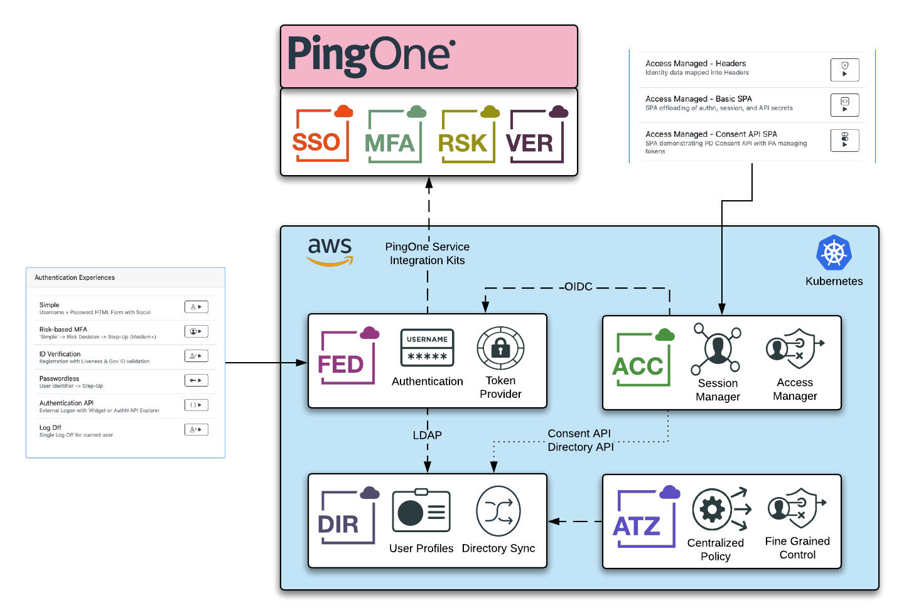

# Project Facile

This repo provides the Server Profiles used by [Project Facile](https://facile.pingidentity.cloud) to deploy a fully wired starting configuration of Ping Identity products.

---

## Pre-Requisites

A PingOne Administrator and Worker App need to be created.

## Deployment

Use the Deployment tools in Facile to perform an [Auto-deployment](https://facile.pingidentity.cloud) into a pre-configured kubernetes namespace, or use the [Bespoke](https://facile.pingidentity.cloud/custom) to generate a `values.yaml` that can be used in your own namespace

## Solution Configuration

| Product | Console URL |
| ----- | ----- |
| Facile Dashboard | `https://facile.pingidentity.cloud/dashboard/{{releaseName}}`

## Documentation

[Documentation](https://docs.facile.pingidentity.cloud)
